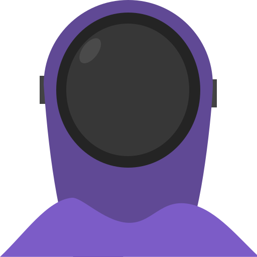
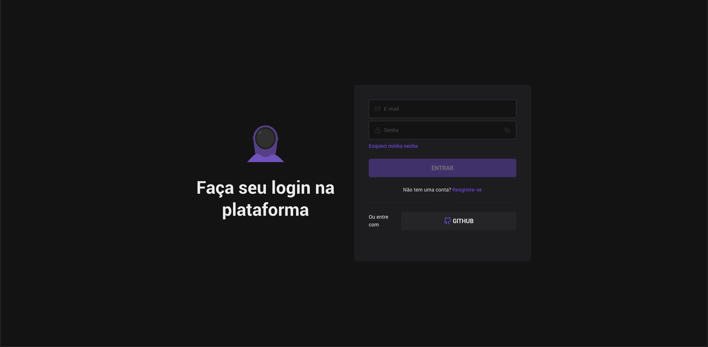

<p align="center">
    
</p>

<h1 align="center">
  Skylab Next
</h1>

<p align="center">
  
  
  
  
  
</p>

<p>This project is a clone ui of the login of @rocketseat using reactjs, typescript, nextjs, and chakra-ui.This site is responsive and uses chakra-ui to define a default of styles</p>
<p align="center">
  <a href="#camera-screenshot">Screenshot</a>&nbsp;&nbsp;&nbsp;|&nbsp;&nbsp;&nbsp;
  <a href="#arrowdown-installations">Installations</a>&nbsp;&nbsp;&nbsp;|&nbsp;&nbsp;&nbsp;
  <a href="#boom-technologies">Technologies</a>&nbsp;&nbsp;&nbsp;|&nbsp;&nbsp;&nbsp;
  <a href="#page_facing_up-license">License</a>
</p>

---

## :camera: Screenshot:




---

## :arrow_down: Installations:

To installations dependencies, follow the steps below:

```
  yarn or npm i // install dependencies
  yarn dev or npm run dev // developer
  yarn run build or npm run build // build
  yarn run start or npm run start // serve
```

## :boom: technologies:

This project contains those technologies:

- [ReactJS](https://reactjs.org/)
- [Typescript](https://www.typescriptlang.org/)
- [nextjs](https://nextjs.org/)
- [chakra-ui](https://chakra-ui.com/)

---

## :page_facing_up: License

This project is MIT licensed, as found in the [LICENSE](https://github.com/janapc/skylab-next/blob/main/LICENSE) file.

---

<br>

Made by Janapc :metal: [Get in touch!](https://www.linkedin.com/in/janaina-pedrina/)
